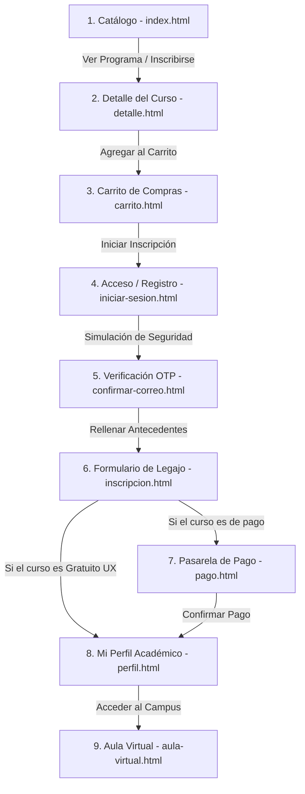

# UNTREF Virtual - Portal de Admisiones e Inscripción

Este proyecto es un portal de admisiones académico interactivo diseñado para la materia **Visualización e Interfaces (UNTREF)**. La plataforma simula el flujo completo de inscripción a carreras universitarias aplicando heurísticas de usabilidad y principios de la psicología de la Gestalt para optimizar la experiencia de usuario (UX).

---

## 🔑 Credenciales de Demostración (Modo Rápido)

Para facilitar la evaluación y presentación del proyecto, se configuró un usuario de prueba registrado. Puedes iniciar sesión con las siguientes credenciales simuladas en la pantalla de acceso:

* **Correo Electrónico (Email Académico):** `j.perez@untref.edu.ar`
* **Contraseña:** `123456` *(o cualquier combinación de caracteres)*

> [!NOTE]
> Al ingresar con estas credenciales, la plataforma cargará automáticamente el perfil académico completo del alumno regular **Juan Pérez** con sus datos personales ficticios pre-cargados (teléfono, correo personal y estado de cursada activa) en el panel de control.

---

## 🗺️ Flujo de Usuario Completo (Acorde a Draw.io)

El sistema implementa de forma secuencial y consistente las páginas que componen el flujo de admisión académica:

### Detalle de cada paso del flujo:

1. **Catálogo de Ofertas (`index.html`):** Portal de inicio con buscador interactivo en tiempo real, filtros por áreas de estudio y tarjetas de carreras que muestran precio, modalidad, duración y estado de arancel.
2. **Detalles del Programa (`pages/detalle.html`):** Ficha técnica extendida de la carrera elegida con breadcrumbs de retorno, plan de estudios estructurado en módulos y botón de compra directa.
3. **Carrito de Compras (`pages/carrito.html`):** Resumen detallado del programa, valoraciones por estrellas y panel de facturación limpio (respetando similitud visual, sin imágenes de portada de cursos).
4. **Acceso o Registro (`pages/iniciar-sesion.html`):** Formulario de acceso con soporte para el correo de demostración.
5. **Verificación de Correo (`pages/confirmar-correo.html`):** Pantalla de seguridad que solicita un código temporal de 4 dígitos enviado a la casilla del alumno.
6. **Formulario de Legajo (`pages/inscripcion.html`):** Registro de antecedentes del postulante agrupados de forma limpia. Si se inscribe a la *Diplomatura UX/UI (Gratuita)*, el sistema oculta automáticamente la pasarela de pagos redirigiéndolo directamente al perfil.
7. **Pasarela de Pago Seguro (`pages/pago.html`):** Tarjeta de crédito interactiva 3D virtual que sincroniza en tiempo real los datos que el usuario tipea y procesa el cobro simulado sumando la matrícula.
8. **Mi Perfil Académico (`pages/perfil.html`):** Panel prioritario del estudiante con la tarjeta del legajo académico activo (`UNTREF-88432`), barra de progreso circular SVG con el porcentaje de avance (35%), centro de descarga directa de certificados y enlace al campus.
9. **Aula Virtual (`pages/aula-virtual.html`):** Reproductor de video integrado para el aula a distancia, índice interactivo de clases y un listado de recursos y archivos descargables del curso activo sin viñetas redundantes.

---

## 🎨 Principios de Diseño e Interfaces Aplicados

### Heurísticas de Usabilidad (Nielsen)
* **Heurística #1 (Visibilidad del estado del sistema):** Diálogos interactivos, barras de progreso y modales de confirmación dinámicos al inscribirse o pagar.
* **Heurística #3 (Control y libertad del usuario):** Breadcrumbs estructurados y botones de retorno claros en todas las pantallas. Dropdown en el navbar para editar datos de contacto o cerrar sesión en cualquier momento.
* **Heurística #4 (Consistencia y estándares):**
  * La navegación es coherente: si el alumno no ha iniciado sesión, el navbar y el footer dicen "Ingresar" / "Iniciar Sesión". Una vez logueado, cambian dinámicamente al nombre del estudiante.
  * Botón de **Modo Oscuro** global sincronizado en el extremo derecho de la cabecera (en móviles se mantiene visible al lado del botón de menú hamburguesa).
* **Heurística #5 (Prevención de errores):** Validación en tiempo real en los inputs de registro y autocompletado inteligente de tarjetas de crédito.
* **Heurística #10 (Ayuda y documentación):** Centro de soporte en el perfil del alumno y datos de ayuda para login.

### Leyes de la Gestalt
* **Ley de Proximidad:** Los formularios agrupan los campos lógicamente (Datos personales vs. Datos académicos).
* **Ley de Similitud:** El diseño de tarjetas de carreras, botones y desgloses de aranceles mantiene colores, tipografía e iconografía uniforme.
* **Ley de Cierre:** El contenedor de resumen de cobros y el plan de estudios delimitan la información relevante dentro de cajas de sombras suaves frente al fondo general.

---

## 🛠️ Tecnologías y Estructura
* **Lenguajes:** HTML5 Semántico, CSS3 Vanilla (sistema de variables nativas para alternancia de modo oscuro/claro) y Vanilla Javascript para toda la reactividad del cliente.
* **Iconografía:** Font Awesome 6.0.0
* **Diseño Responsivo:** Adaptado completamente a dispositivos de escritorio, tablets y pantallas móviles (Mobile-first).
